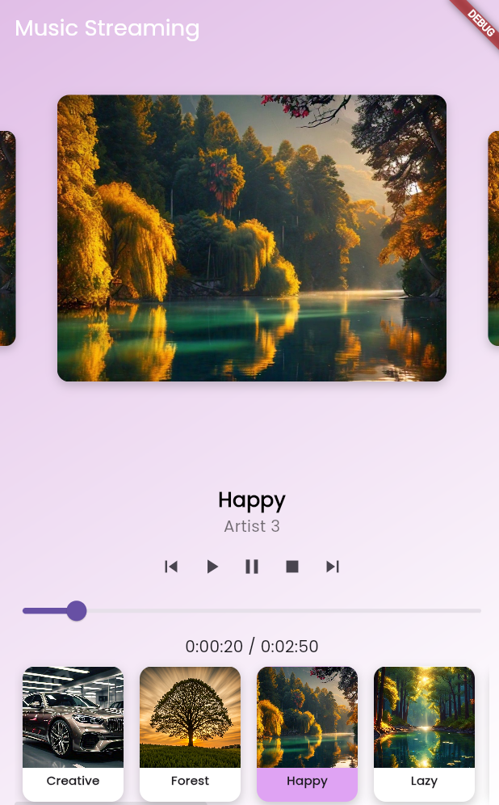

# Music Streaming App 🎵

A Flutter-based music streaming app that allows you to listen to songs directly from Firebase Storage. The app features a modern UI, carousel sliders for songs, and a creative bottom card list for easy selection.

## Features

- **Carousel Slider**: A carousel slider that shows songs with hover effects.
- **Firebase Storage Integration**: Fetch and play music files stored in Firebase.
- **Playback Controls**: Play, pause, stop, next, previous, and seek functionalities using the `just_audio` package.
- **Song Cards**: Small cards at the bottom for quick song selection.

## Getting Started

### Prerequisites

- **Flutter**: Ensure Flutter is installed and properly set up.
- **Firebase Project**: Set up a Firebase project and integrate it with your app.

### Setup Instructions

1. Clone the repository:

    ```sh
    git clone https://github.com/Nikhil-Pawar11/music_streaming_app
    ```

2. Navigate to the project directory:

    ```sh
    cd music_streaming_app
    ```

3. Install the dependencies:

    ```sh
    flutter pub get
    ```

## Adding Songs to Firebase

To add songs to Firebase and configure your app, follow these steps:

### 1. Create a Firebase Spark Account

1. Go to the [Firebase Console](https://console.firebase.google.com/).
2. Click on "Get Started" and create a new Firebase account if you don’t have one.
3. Once your account is created, click on "Add project" and follow the prompts to create a new Firebase project.

### 2. Configure Firebase Storage

1. In your Firebase project dashboard, navigate to **Storage** in the left sidebar.
2. Click on **Get Started** to set up Cloud Storage.
3. Choose the **Firebase Storage** option and click **Next**.
4. Set the security rules as needed (for development, you can set it to allow read and write).
5. Click **Done** to complete the setup.

### 3. Upload Songs to Firebase Storage

1. In the **Storage** section, click on **Upload files**.
2. Select the audio files (e.g., `creative.mp3`, `forest.mp3`, etc.) you want to upload.
3. Once uploaded, note the file names as you'll need them for your app.

### 4. Download the JSON File

1. Go to **Project Settings** (gear icon next to "Project Overview") in the Firebase Console.
2. In the **General** tab, scroll down to the **Your apps** section.
3. If you haven't added your app yet, click on **Add app** and follow the prompts to register your Android app.
4. Download the `google-services.json` file and place it in your `android/app` directory.

### 5. Download Firebase CLI

1. Install Firebase CLI if you haven't already. Run the following command in your terminal:

    ```sh
    npm install -g firebase-tools
    ```

### 6. Create `firebase_options.dart` Using Firebase CLI

1. Open your terminal and navigate to your project directory:

    ```sh
    cd music_streaming_app
    ```

2. Run the following command to initialize Firebase:

    ```sh
    firebase init
    ```

3. Follow the prompts to select the Firebase features you want to set up, ensuring you choose **Functions** and **Hosting**.
4. After initialization, run the following command to generate the `firebase_options.dart` file:

    ```sh
    flutter pub run firebase_options:generate
    ```

5. Place the generated `firebase_options.dart` file in your project directory.

Now your app is ready to access the songs stored in Firebase Storage!

### Running the App

To run the app, use:

```sh
flutter run
```

Ensure you have an Android emulator or a physical device connected.

## Screenshots


### Music Player

<p align="center">
    
</p>


## Video
[Watch the Demo](video/music_streaming_app.mp4)

## App Structure

- **main.dart**: Entry point of the application.
- **MusicStreamingApp**: Main app class defining the UI.
- **MusicScreen**: Stateful widget that manages the current song and provides controls.

## Features Highlight

- **Carousel Slider** for displaying songs with a hover effect.
- **Integration with Firebase Storage** for fetching and playing music files.
- **Play, pause, stop, and seek functionalities** using the `just_audio` package.
- **Small cards** list at the bottom for quick song selection.

## How to Use

1. Swipe through the carousel to explore different songs.
2. Tap on any song to start playing.
3. Use playback controls to play, pause, or change tracks.
4. Scroll through the creative card list to select a song quickly.

## Contributing

Feel free to fork this repository and contribute by submitting a pull request. Any contributions are appreciated!

## License

Distributed under the MIT License. See `LICENSE` for more information.


